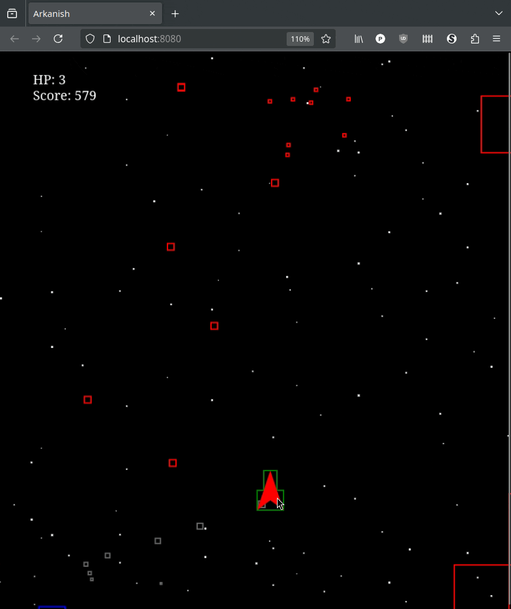

# Random Top-Scroller Shooter

A top-scrolling shooter browser game, hand-written in TypeScript with no production libraries.  This is an escape project (because the world feels insane these days).

## Running Locally

Requires yarn to build or run in dev mode.  I'm using 1.22.22, because I've been too lazy to upgrade and front-end development is mostly a hobby.

1. In your terminal, run `yarn` to install.
2. Also in your terminal, run `yarn start`.
3. Point your web browser to http://localhost:8080.
4. Have fun.
